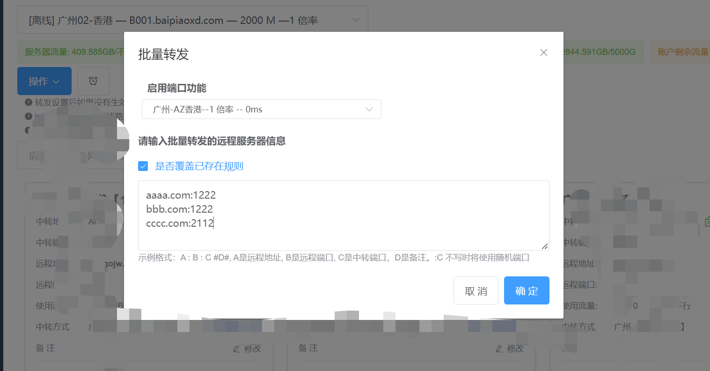

# v2board批量添加中转节点

方便为直连节点添加闲蛋中转

### 1.配置config/app.ini文件

开始配置好mysql的库,允许msql远程连接,中转节点信息（保证数据库可以连接,否则运行会闪退）

```ini
; MYSQL 的配置
MYSQL_IP = 222.333.111.111
MYSQL_PORT = 3306
MYSQL_USER_NAME = xxx
MYSQL_DB_NAME = xxx
MYSQL_PASSWORD = xxxxxxx
;中转url
ZHONG_ZHUAN_URL = xxx.xxx.xxx
;中转名称
ZHONG_ZHUAN_NAME = 香港02测试
;是否向用户显示 1 显示 0 不显示
SHOW = 1
```

### 2.运行v2zf

```shell
1. 获取所有直连节点批量添加的模板
2. 每个节点添加 conifg/ini 中配置的中转,提前在当前目录下放好咸蛋面板导出的json文件,只能有一个json文件
3. 根据关键词删除中转节点(默认为配置文件的中转名称)
请选择选项:
```

选择1

获取批量添加的模板,复制到咸蛋面板中


导出配置，获取json文件，将json文件放在程序运行目录下,选择2，等待执行完成

### 刷新面板,中转节点添加完成


